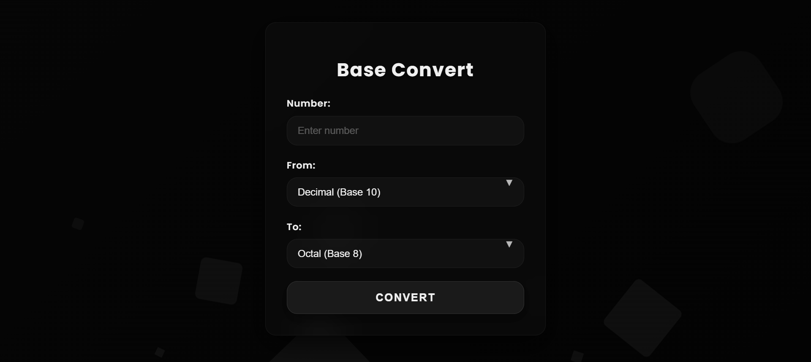

# BaseConvert

A sleek, minimalist, and highly interactive web application for converting numbers between various number systems (Binary, Decimal, Octal, Hexadecimal). Built with Python Flask for the backend logic and a modern UI by HTML, CSS, and JavaScript.

---

## 📚 Table of Contents

- [Features](#-features)
- [Technologies Used](#-technologies-used)
- [Screenshots](#-screenshots)
- [How to Run Locally](#️-how-to-run-locally)
- [Contributing](#-contributing)
- [License](#-license)
- [Contact](#-contact)

---

## ✨ Features

* **Number System Conversion:** Seamlessly convert numbers between Base 2 (Binary), Base 8 (Octal), Base 10 (Decimal), and Base 16 (Hexadecimal).
* **Modern UI:** A visually stunning user interface with transparent, frosted glass effects, subtle animations, and a dark, elegant theme.
* **Floating Result Animation:** Results are displayed dynamically as large, glowing numbers that float up and fade away, providing a unique and satisfying user experience.
* **Real-time Client-Side Validation:** Immediate feedback for invalid inputs based on the selected base.
* **Responsive Design:** Optimized for a great user experience on both desktop and mobile devices.
* **Clean & Intuitive:** A simple, single-page interface focusing purely on the conversion functionality.

---

## 🚀 Technologies Used

* **Backend:**
    * Python 3
    * Flask (Web Framework)
* **Frontend:**
    * HTML5
    * CSS3
    * JavaScript

---

## 📸 Screenshot



---

## 🛠️ How to Run Locally

Follow these steps to set up and run the project on your local machine:

1.  **Clone the repository:**
    ```bash
    git clone https://github.com/adwaithprasanth/Base-Convert.git
    cd Base-Convert
    ```

2.  **Create a Python Virtual Environment:**
    ```bash
    python3 -m venv venv
    ```

3.  **Activate the Virtual Environment:**
    * **On macOS/Linux:**
        ```bash
        source venv/bin/activate
        ```
    * **On Windows:**
        ```bash
        venv\Scripts\activate
        ```

4.  **Install the required dependencies:**
    ```bash
    pip install Flask
    ```

5.  **Run the application:**
    ```bash
    flask run
    ```
    or
    ```bash
    python app.py
    ```

6.  **Access the application:**
    Open your web browser and go to `http://127.0.0.1:5000/`.

---

## 🤝 Contributing

Contributions, issues, and feature requests are welcome! Feel free to check the [issues page](https://github.com/adwaithprasanth/Base-Convert/issues).

1.  **Fork** the repository.
2.  **Create a new branch** for your feature or bug fix:  
    ```bash
    git checkout -b feature-name
    ```
3.  **Make your changes** and commit them:  
    ```bash
    git commit -m 'Descriptive commit message'
    ```
4.  **Push** to your fork:  
    ```bash
    git push origin feature-name
    ```
5.  **Create a Pull Request** to the `main` branch of this repository.

---

## 📄 License

This project is open source and available under the [MIT License](https://opensource.org/licenses/MIT).

---

## 📧 Contact

[GitHub](https://github.com/adwaithprasanth)  
[LinkedIn](https://www.linkedin.com/in/adwaithprasanth)

---
